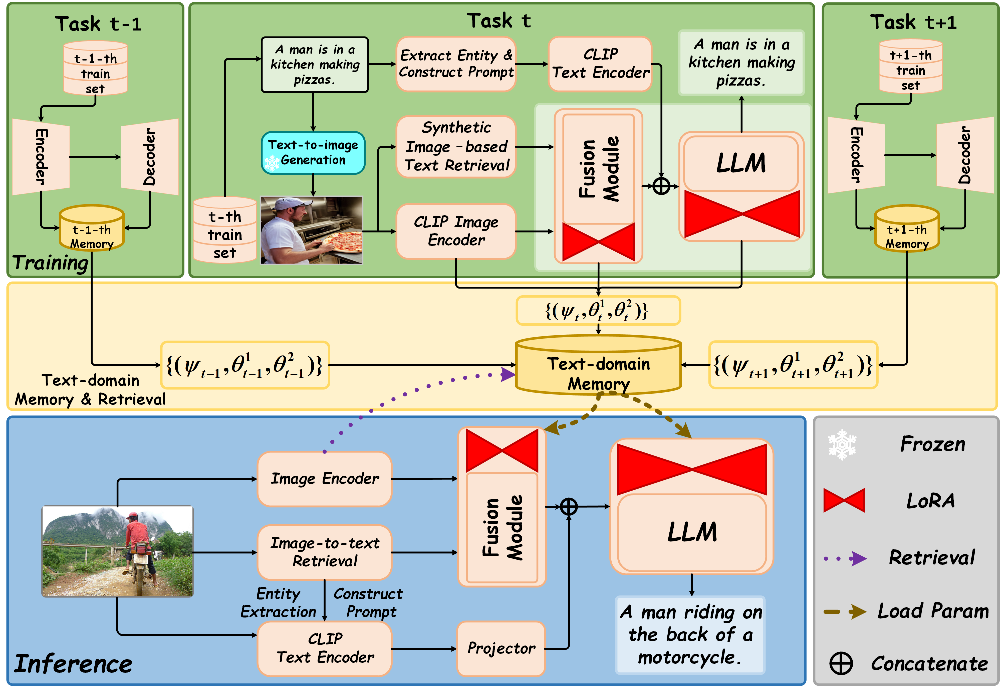

# CZC
CZC: Continual Zero-shot Image Captioning (submmit to AAAI2026)


## Abstract
Zero-shot captioning enables image-to-text generation without the need for image-text pairs. However, current approaches face two critical challenges: (1) discrepancies in input modalities between training and inference, and (2) shifts in the text domain during continual learning. To address these issues, we propose two novel methods: Synthetic Image–based Text Retrieval (SITR) and Text-domain Memory Retrieval (TMR). SITR bridges the training and inference modalities by generating synthetic images and aids caption generation through similar sentence retrieval. TMR, on the other hand, mitigates text-domain shifts by enabling parameter-efficient fine-tuning, allowing continual zero-shot captioning across tasks without forgetting prior knowledge. Our approach not only enhances zero-shot captioning performance for individual tasks but also, for the first time, supports continual zero-shot captioning across multiple tasks. The code is available at https://anonymous.4open.science/r/CZC-AAAI-51DD. 

## Compared to Other Methods


## Framework


---
### Conda environment
```bash
conda create -n czc python=3.9
conda activate czc
pip install -r requirements.txt
```

### Data preparation
Download annotations, evaluation tools.
```
bash scripts/download.sh
```

Please use the [stable-diffusionv1.5](https://huggingface.co/stable-diffusion-v1-5/stable-diffusion-v1-5) and [Text2Earth](https://chen-yang-liu.github.io/Text2Earth/) to synthetic all images for text and use CLIP-RN50x64 to extract the CLIP image embedding like IFCap. 
*The annotation file should be organized to a 2-D LIST, the order of each elements should be [detected_entities, caption, caption_clip_features (vit-b/32), caption-id, synthetic_img_fearures(vit-b/32)]*

```
# place your coco images in annotations/coco/val2014

# synthetic image-based text retrieval
python src/read_generated_image_wo_class_img_cap.py --domain_source coco --domain_test coco --L 9

# entity filtering
python src/entity_filtering.py # with IDX=1
```

```
# place your flickr30k images in annotations/flickr30k/flickr30k-images

# synthetic image-based text retrieval
python src/python src/read_generated_image_wo_class_img_cap.py
.py --domain_source flickr30k --domain_test flickr30k --L 7

# entity filtering
python src/entity_filtering.py # with IDX=0
```

For MSVD and MSRVTT
```
cd annotations/{msvd, msrvtt}
python build_dataset/build_dataset.py

# Place corresponding videos in annotations/{msvd, msrvtt}/videos
cd ../..
python src/sample_frame.py # idx 0 for MSVD, 1 for MSRVTT

# For extracting feature
python src/entities_extraction.py # idx 2 for MSVD, 3 for MSRVTT
python src/texts_features_extraction.py # idx 2 for MSVD, 3 for MSRVTT
python src/video_features_extraction.py # idx 0 for MSVD, 1 for MSRVTT


# image-to-text retrieval
python src/python src/read_generated_image_wo_class_img_cap.py --domain_source msvd --domain_test msvd --video --L 7
python src/python src/read_generated_image_wo_class_img_cap.py --domain_source msrvtt --domain_test msrvtt --video --L 7

# entity filtering
python src/entity_filtering.py # with idx 3 for MSVD, 4 for MSRVTT
```

For SYDNEY and UCM
```
# please refer the coco to construct the datasets

# For extracting feature
python src/entities_extraction.py # idx 4 for SYDNEY, 5 for UCM
python src/texts_features_extraction.py # idx 4 for SYDNEY, 5 for UCM
python src/video_features_extraction.py # idx 4 for SYDNEY, 5 for UCM


# image-to-text retrieval
python src/read_generated_image_wo_class_rem_img_cap.py --domain_source SYDNEY --domain_test SYDNEY  --L 9
python src/read_generated_image_wo_class_rem_img_cap.py --domain_source UCM --domain_test UCM --L 9

# entity filtering
python src/entity_filtering.py # idx 4 for SYDNEY, 5 for UCM
```

### Training

For COCO,
```
# bash scripts/train_coco.sh CUDA_DEVICE TEST_NAME RT_PATH
bash scripts/train_coco.sh 0 coco annotations/coco/coco_train_woclass.json
```

For Flickr30k
```
# bash scripts/train_flickr30k.sh CUDA_DEVICE TEST_NAME RT_PATH
bash scripts/train_flickr30k.sh 0 flickr annotations/flickr30k/flickr30k_train_woclass.json
```

For MSVD
```
# bash scripts/train_msvd.sh CUDA_DEVICE TEST_NAME RT_PATH
bash scripts/train_msvd.sh 0 msvd annotations/msvd/msvd_train_woclass.json
```

For MSRVTT
```
# bash scripts/train_msrvtt.sh CUDA_DEVICE TEST_NAME RT_PATH
bash scripts/train_msrvtt.sh 0 msrvtt annotations/msrvtt/msrvtt_train_woclass.json
```

For SYDNEY
```
# bash scripts/train_sydney.sh CUDA_DEVICE TEST_NAME RT_PATH
bash scripts/train_sydney.sh 0 sydney annotations/sydney/sydney_train_woclass.json
```

For UCM
```
# bash scripts/train_ucm.sh CUDA_DEVICE TEST_NAME RT_PATH
bash scripts/train_ucm.sh 0 ucm annotations/ucm/ucm_train_woclass.json
```

### Inference
[TBD]


## Acknowledgments

This repository is based on [IFCap](https://github.com/boreng0817/IFCap), [pycocotools](https://github.com/sks3i/pycocoevalcap) repositories. Thanks for sharing the source codes!

***